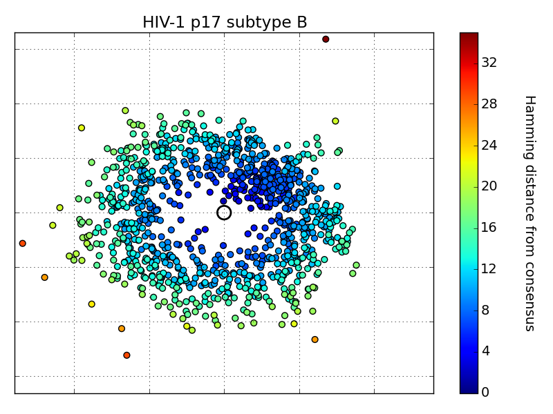

# Clusterforce
Cluster sequences in an alignment in with force fields.



## Usage
Go into the folder and follow the example:
```python
python2 examples/example_HIV.py
```

It boils down to:
```python
from clusterforce.clustering import cluster_force
points = cluster_force(my_alignment)
```

Enjoy!
